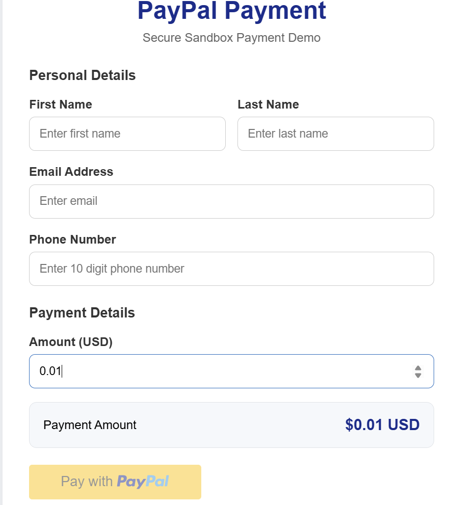
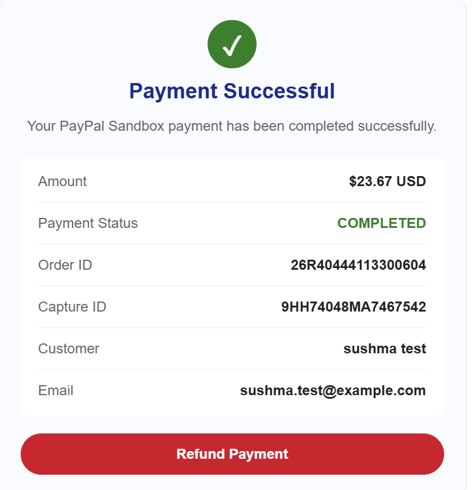
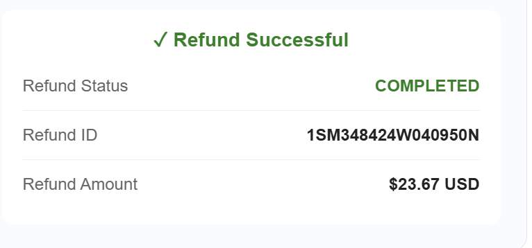
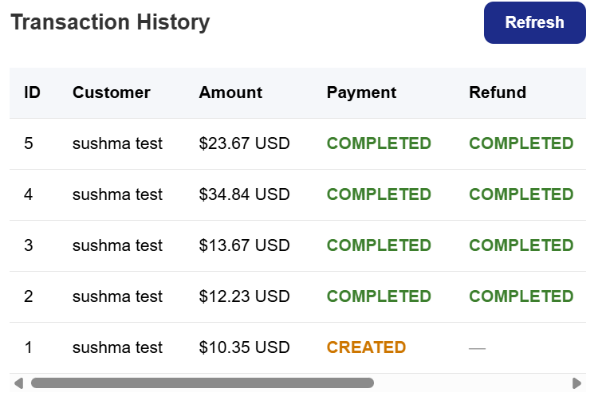

# PayPal Payment Integration – React + Spring Boot + MySQL

A full-stack PayPal Sandbox payment integration project built using **React, Java, Spring Boot, MySQL, and PayPal REST APIs**.

The application demonstrates the complete payment lifecycle including order creation, payment capture, refunds, database persistence, validation, and transaction history.

> This project uses the **PayPal Sandbox environment**. No real money is processed.

---

## Features

- PayPal Sandbox integration
- PayPal OAuth 2.0 authentication
- Dynamic payment amount
- Customer information form
- Email validation
- 10-digit phone validation
- Payment amount validation
- PayPal order creation
- PayPal payment capture
- Full payment refund
- Refund directly after payment
- Refund from Transaction History
- MySQL transaction persistence
- Automatic transaction history
- Automatic history refresh after payment
- Automatic history refresh after refund
- Secure environment-variable based credentials

---

## Tech Stack

### Frontend

- React
- JavaScript
- Vite
- HTML5
- CSS3
- PayPal React SDK

### Backend

- Java 21
- Spring Boot
- Spring Web
- Spring REST Client
- Spring Data JPA
- Hibernate
- Maven

### Database

- MySQL
- MySQL Workbench

### Payment Integration

- PayPal REST API
- PayPal Sandbox
- OAuth 2.0
- Orders API
- Capture API
- Refund API

### Development Tools

- Postman
- VS Code
- Git
- GitHub

---

## Application Architecture

```text
                    React Frontend
                  http://localhost:5173
                           |
                           |
                        REST API
                           |
                           v
                    Spring Boot API
                  http://localhost:8080
                     /           \
                    /             \
                   v               v
          PayPal Sandbox          MySQL
             REST API       paypal_payment_db
Payment Flow
User enters personal details
        |
        v
User enters payment amount
        |
        v
React validates the form
        |
        v
Spring Boot Create Order API
        |
        v
PayPal Sandbox creates order
        |
        v
Transaction stored in MySQL
        |
        v
Buyer approves PayPal payment
        |
        v
Spring Boot captures payment
        |
        v
Capture ID + COMPLETED status stored
        |
        v
User can request refund
        |
        v
PayPal processes refund
        |
        v
Refund ID + COMPLETED status stored
        |
        v
Transaction History automatically updates
Customer Information

The application collects:

First Name
Last Name
Email Address
Phone Number
Payment Amount

Example request:

{
  "firstName": "Sushma",
  "lastName": "Test",
  "email": "sushma.test@example.com",
  "phone": "2347855689",
  "amount": 12.23
}
Form Validation

The React frontend validates user input before enabling PayPal checkout.

Validation includes:

First name is required
Last name is required
Valid email address
10-digit phone number
Payment amount greater than zero

Example validation messages:

Please enter a valid email address.

Phone number must contain 10 digits.

Amount must be greater than $0.

The PayPal button remains disabled until all required fields contain valid values.

REST API Endpoints
Backend Health Check
GET /api/paypal/test
PayPal Authentication Test
GET /api/paypal/auth-test
Create PayPal Order
POST /api/paypal/create-order

Example request:

{
  "firstName": "Sushma",
  "lastName": "Test",
  "email": "sushma.test@example.com",
  "phone": "2347855689",
  "amount": 12.23
}
Capture PayPal Order
POST /api/paypal/capture-order/{orderId}
Refund Payment
POST /api/paypal/refund/{captureId}
Get Transaction History
GET /api/paypal/transactions
Database

Database name:

paypal_payment_db

Main table:

payment_transactions

The transaction table stores:

id
first_name
last_name
email
phone
amount
currency
order_id
capture_id
payment_status
refund_id
refund_status
created_at
updated_at
Database Transaction Lifecycle
CREATE ORDER
     |
     v
INSERT transaction into MySQL
     |
     v
CAPTURE PAYMENT
     |
     v
Update capture_id
Update payment_status = COMPLETED
     |
     v
REFUND PAYMENT
     |
     v
Update refund_id
Update refund_status = COMPLETED
Transaction History

The application retrieves previous transactions from MySQL and displays them in the React frontend.

Example:

ID	Customer	Amount	Payment Status	Refund Status	Action
3	Sushma Test	$13.67 USD	COMPLETED	COMPLETED	Refunded
2	Sushma Test	$12.23 USD	COMPLETED	COMPLETED	Refunded
1	Sushma Test	$10.35 USD	CREATED	—	—

Transaction History automatically refreshes:

When the application starts
After successful payment capture
After a successful refund

A manual Refresh button is also available.

Refund From Transaction History

Completed transactions that have not yet been refunded display a Refund button.

This allows users to refund an eligible payment even after:

Refreshing the browser
Closing the browser
Reopening the application

After a successful refund:

Refund → Refunded

The refund information is also updated in MySQL automatically.


One important Markdown rule: for architecture, payment flow, JSON, commands, etc., use **three backticks**:

````text
```text
your content

not a single:

```text
`
```

Also change:

```markdown
**Payment Flow**
```

to:

```markdown
## Payment Flow
```

That way GitHub displays it as a proper section heading.

Your README will then flow cleanly as:

```text
Project Title
    ↓
Overview
    ↓
Features
    ↓
Tech Stack
    ↓
Application Architecture
    ↓
Payment Flow
    ↓
Customer Information
    ↓
Validation
    ↓
REST APIs
    ↓
Database
    ↓
Transaction History
    ↓
Refund From History
    ↓
Project Setup
    ↓
Screenshots
    ↓
Future Enhancements
```

This will look much cleaner on the GitHub repository page.

## Screenshots

### Payment Form

The payment form collects customer details and allows the user to enter a dynamic payment amount before starting the PayPal Sandbox checkout.



---

### Payment Successful

After the PayPal Sandbox buyer approves the payment, the application captures the order and displays the payment status, Order ID, Capture ID, customer details, and payment amount.



---

### Refund Successful

A completed payment can be fully refunded. After a successful refund, the application displays the Refund ID, refund status, and refunded amount.



---

### Transaction History

Transaction history is loaded from MySQL through the Spring Boot backend. It displays payment and refund statuses for previous transactions and allows eligible payments to be refunded from history.


